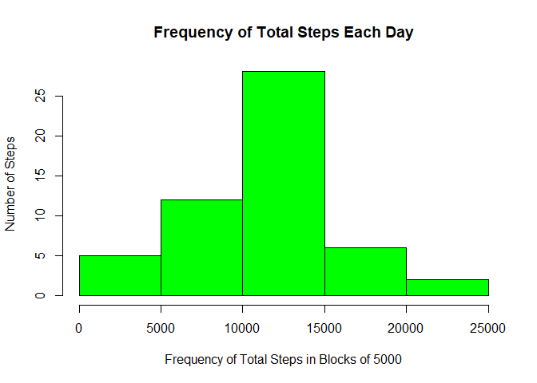
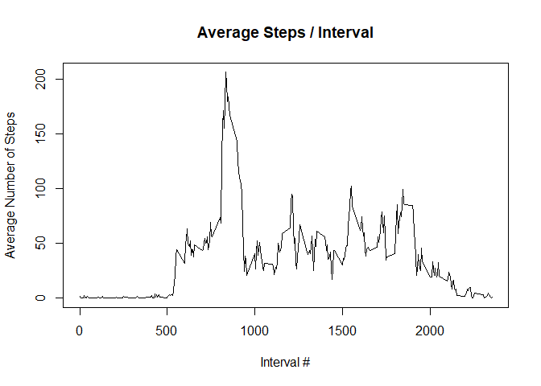
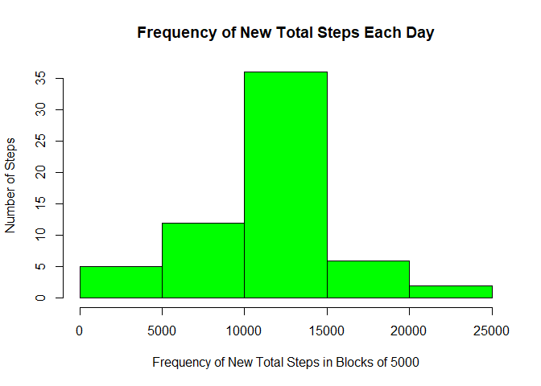
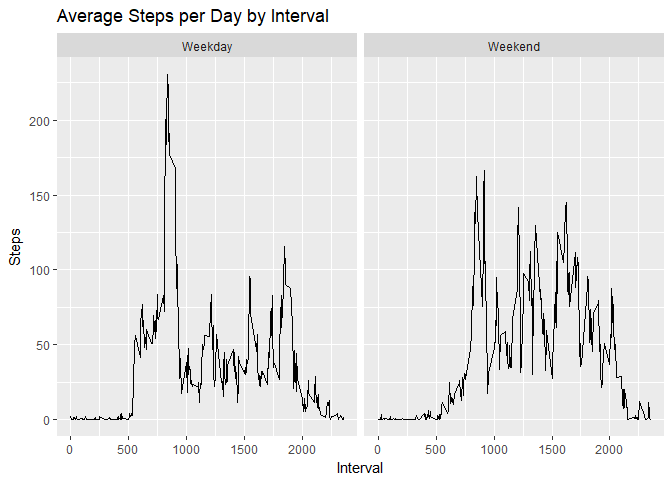

This assignment makes use of data from a personal activity monitoring device. This device collects data at 5 minute intervals through out the day. The data consists of two months of data from an anonymous individual collected during the months of October and November, 2012 and include the number of steps taken in 5 minute intervals each day.
The data for this assignment can be downloaded from the course web site:
Dataset: Activity monitoring data [52K]
The variables included in this dataset are:
steps: Number of steps taking in a 5-minute interval (missing values are coded as NA)
date: The date on which the measurement was taken in YYYY-MM-DD format
interval: Identifier for the 5-minute interval in which measurement was taken
The dataset is stored in a comma-separated-value (CSV) file and there are a total of 17,568 observations in this dataset.

## Loading and preprocessing the data
Show any code that is needed to
Load the data (i.e. read.csv())
Process/transform the data (if necessary) into a format suitable for your analysis


```r
setwd ("C:/Users/Edward/Documents/Analysis of Data/Repro Research")
activity <- read.csv(file="C:/Users/Edward/Documents/Analysis of Data/Repro Research/activity.csv",header = TRUE, sep = ",")
str(activity)
```

```
## 'data.frame':	17568 obs. of  3 variables:
##  $ steps   : int  NA NA NA NA NA NA NA NA NA NA ...
##  $ date    : Factor w/ 61 levels "2012-10-01","2012-10-02",..: 1 1 1 1 1 1 1 1 1 1 ...
##  $ interval: int  0 5 10 15 20 25 30 35 40 45 ...
```

```r
summary(activity)
```

```
##      steps                date          interval     
##  Min.   :  0.00   2012-10-01:  288   Min.   :   0.0  
##  1st Qu.:  0.00   2012-10-02:  288   1st Qu.: 588.8  
##  Median :  0.00   2012-10-03:  288   Median :1177.5  
##  Mean   : 37.38   2012-10-04:  288   Mean   :1177.5  
##  3rd Qu.: 12.00   2012-10-05:  288   3rd Qu.:1766.2  
##  Max.   :806.00   2012-10-06:  288   Max.   :2355.0  
##  NA's   :2304     (Other)   :15840
```

## Quick Data Review:

The original data has "date"" as a factor and contains 2304 NA's.

To operate more effectively on time line data conversion to "Date Format" is required.
Initially the NA's will be left out by the tools that are used in the analysis.


```r
activity$date <- as.Date(activity$date)
str(activity)
```

```
## 'data.frame':	17568 obs. of  3 variables:
##  $ steps   : int  NA NA NA NA NA NA NA NA NA NA ...
##  $ date    : Date, format: "2012-10-01" "2012-10-01" ...
##  $ interval: int  0 5 10 15 20 25 30 35 40 45 ...
```

```r
summary(activity)
```

```
##      steps             date               interval     
##  Min.   :  0.00   Min.   :2012-10-01   Min.   :   0.0  
##  1st Qu.:  0.00   1st Qu.:2012-10-16   1st Qu.: 588.8  
##  Median :  0.00   Median :2012-10-31   Median :1177.5  
##  Mean   : 37.38   Mean   :2012-10-31   Mean   :1177.5  
##  3rd Qu.: 12.00   3rd Qu.:2012-11-15   3rd Qu.:1766.2  
##  Max.   :806.00   Max.   :2012-11-30   Max.   :2355.0  
##  NA's   :2304
```

# What is mean total number of steps taken per day?
At this point we will ignore the missing values in the dataset.

## Calculate the total number of steps taken per day


```r
steps_day <- aggregate(steps ~ date, activity, sum)
str(steps_day)
```

```
## 'data.frame':	53 obs. of  2 variables:
##  $ date : Date, format: "2012-10-02" "2012-10-03" ...
##  $ steps: int  126 11352 12116 13294 15420 11015 12811 9900 10304 17382 ...
```

## Make a histogram of the total number of steps taken each day


```r
hist(steps_day$steps, main = paste("Frequency of Total Steps Each Day"), col="green", ylab="Number of Steps",xlab = "Frequency of Total Steps in Blocks of 5000")
```

<!-- -->

## Calculate and report the mean and median of the total number of steps taken per day


```r
rmean <- mean(steps_day$steps)
rmean
```

```
## [1] 10766.19
```

```r
rmedian <- median(steps_day$steps)
rmedian
```

```
## [1] 10765
```

# What is the average daily activity pattern?

## Make a time series plot of the 5-minute interval (x-axis) and the average number of steps taken, averaged across all days (y-axis)
To achieve this we need to aggregate the data and caculate the mean number of steps for each interval.
Returning a "data.frame" with the data will allow us to create the required plot.


```r
interval_steps<-aggregate(steps ~ interval, activity, mean)
str(interval_steps)
```

```
## 'data.frame':	288 obs. of  2 variables:
##  $ interval: int  0 5 10 15 20 25 30 35 40 45 ...
##  $ steps   : num  1.717 0.3396 0.1321 0.1509 0.0755 ...
```

```r
summary(interval_steps)
```

```
##     interval          steps        
##  Min.   :   0.0   Min.   :  0.000  
##  1st Qu.: 588.8   1st Qu.:  2.486  
##  Median :1177.5   Median : 34.113  
##  Mean   :1177.5   Mean   : 37.383  
##  3rd Qu.:1766.2   3rd Qu.: 52.835  
##  Max.   :2355.0   Max.   :206.170
```

## Required Plot


```r
plot(interval_steps$interval,interval_steps$steps, type="l", xlab="Interval #", ylab="Average Number of Steps",main="Average Steps / Interval")
```

<!-- -->

# Which 5-minute interval, on average across all the days in the dataset, contains the maximum number of steps?

To return this answer we calculate the interval with the maximum number of steps.


```r
highinterval <- interval_steps[which.max(interval_steps$steps),1]      
highinterval
```

```
## [1] 835
```

# Imputing missing values
It was noted that there are a number of days/intervals where there are missing values (coded as NA). The presence of missing days may introduce bias into some calculations or summaries of the data. In order to understand this situation we were asked to:

## Calculate and report the total number of missing values in the dataset (i.e. the total number of rows with NAs)


```r
missing <- sum(!complete.cases(activity))
missing
```

```
## [1] 2304
```

## Number of data points with missing data.
There are 2304 NAs in the original "activity" data. We also saw this in the summary that was done initally on the data.

## Devise a strategy for filling in all of the missing values in the dataset. 
We chose to replace the NAs with the mean number of steps in the corresponding interval.

## Create a new dataset that is equal to the original dataset but with the missing data filled in.
The new dataset is called "addactivity"


```r
addactivity <- transform(activity,steps = ifelse(is.na(activity$steps), interval_steps$steps[match(activity$interval, interval_steps$interval)], activity$steps))
str(addactivity)
```

```
## 'data.frame':	17568 obs. of  3 variables:
##  $ steps   : num  1.717 0.3396 0.1321 0.1509 0.0755 ...
##  $ date    : Date, format: "2012-10-01" "2012-10-01" ...
##  $ interval: int  0 5 10 15 20 25 30 35 40 45 ...
```

```r
summary(addactivity)
```

```
##      steps             date               interval     
##  Min.   :  0.00   Min.   :2012-10-01   Min.   :   0.0  
##  1st Qu.:  0.00   1st Qu.:2012-10-16   1st Qu.: 588.8  
##  Median :  0.00   Median :2012-10-31   Median :1177.5  
##  Mean   : 37.38   Mean   :2012-10-31   Mean   :1177.5  
##  3rd Qu.: 27.00   3rd Qu.:2012-11-15   3rd Qu.:1766.2  
##  Max.   :806.00   Max.   :2012-11-30   Max.   :2355.0
```

## Make a histogram of the total number of steps taken each day and Calculate and report the mean and median total number of steps taken per day.
To achieve this requirement it was necessary to aggregate the new data into a data.frame
"newsteps_day"
A histogram was plotted with the new data and the mean and medians were calculated.

```r
newsteps_day <- aggregate(steps ~ date, addactivity, sum)
str(newsteps_day)
```

```
## 'data.frame':	61 obs. of  2 variables:
##  $ date : Date, format: "2012-10-01" "2012-10-02" ...
##  $ steps: num  10766 126 11352 12116 13294 ...
```

```r
hist(newsteps_day$steps, main = paste("Frequency of New Total Steps Each Day"), col="green", ylab="Number of Steps",xlab = "Frequency of New Total Steps in Blocks of 5000")
```

<!-- -->

```r
newrmean <- mean(newsteps_day$steps)
newrmean
```

```
## [1] 10766.19
```

```r
rmean <- mean(steps_day$steps)
rmean
```

```
## [1] 10766.19
```

```r
newrmedian <- median(newsteps_day$steps)
newrmedian
```

```
## [1] 10766.19
```

```r
rmedian <- median(steps_day$steps)
rmedian
```

```
## [1] 10765
```

## Do these values differ from the estimates from the first part of the assignment?

Comparison of the means show no significant difference for the mean. Adding datapoints at the mean should not impact the mean calculation.

Comparison of the median show a shift in the calculated median for each dataset. This should be expected. The median reflects the center of the data. Having more datapoints in the calculation typically would reflect a shift in the center.

## What is the impact of imputing missing data on the estimates of the total daily number of steps?

We can demonstrate the impact of the addition of datapoints by comparing the total steps recorded in each dataset.


```r
step_diff <- sum(newsteps_day$steps) - sum(interval_steps$steps)
step_diff
```

```
## [1] 645971.3
```

# Are there differences in activity patterns between weekdays and weekends?

## Create a new factor variable in the dataset with two levels - "weekday" and "weekend" indicating whether a given date is a weekday or weekend day.


```r
weekdays <- c('Monday', 'Tuesday', 'Wednesday', 'Thursday', 'Friday')
addactivity$weekend = as.factor(ifelse(is.element(weekdays(as.Date(addactivity$date)),weekdays), "Weekday", "Weekend"))
str(addactivity)
```

```
## 'data.frame':	17568 obs. of  4 variables:
##  $ steps   : num  1.717 0.3396 0.1321 0.1509 0.0755 ...
##  $ date    : Date, format: "2012-10-01" "2012-10-01" ...
##  $ interval: int  0 5 10 15 20 25 30 35 40 45 ...
##  $ weekend : Factor w/ 2 levels "Weekday","Weekend": 1 1 1 1 1 1 1 1 1 1 ...
```

```r
summary(addactivity)
```

```
##      steps             date               interval         weekend     
##  Min.   :  0.00   Min.   :2012-10-01   Min.   :   0.0   Weekday:12960  
##  1st Qu.:  0.00   1st Qu.:2012-10-16   1st Qu.: 588.8   Weekend: 4608  
##  Median :  0.00   Median :2012-10-31   Median :1177.5                  
##  Mean   : 37.38   Mean   :2012-10-31   Mean   :1177.5                  
##  3rd Qu.: 27.00   3rd Qu.:2012-11-15   3rd Qu.:1766.2                  
##  Max.   :806.00   Max.   :2012-11-30   Max.   :2355.0
```

## Make a panel plot containing a time series plot of the 5-minute interval (x-axis) and the average number of steps taken, averaged across all weekday days or weekend days (y-axis).


```r
newinterval_steps <- aggregate(steps ~ interval + weekend, addactivity, mean)
str(newinterval_steps)
```

```
## 'data.frame':	576 obs. of  3 variables:
##  $ interval: int  0 5 10 15 20 25 30 35 40 45 ...
##  $ weekend : Factor w/ 2 levels "Weekday","Weekend": 1 1 1 1 1 1 1 1 1 1 ...
##  $ steps   : num  2.251 0.445 0.173 0.198 0.099 ...
```

```r
library(ggplot2)
g<- ggplot(newinterval_steps, aes(interval, steps))
        g + geom_line() + facet_grid(. ~ weekend) +
         labs(x = "Interval", y = "Steps")+
          labs(title = "Average Steps per Day by Interval")  
```

<!-- -->


